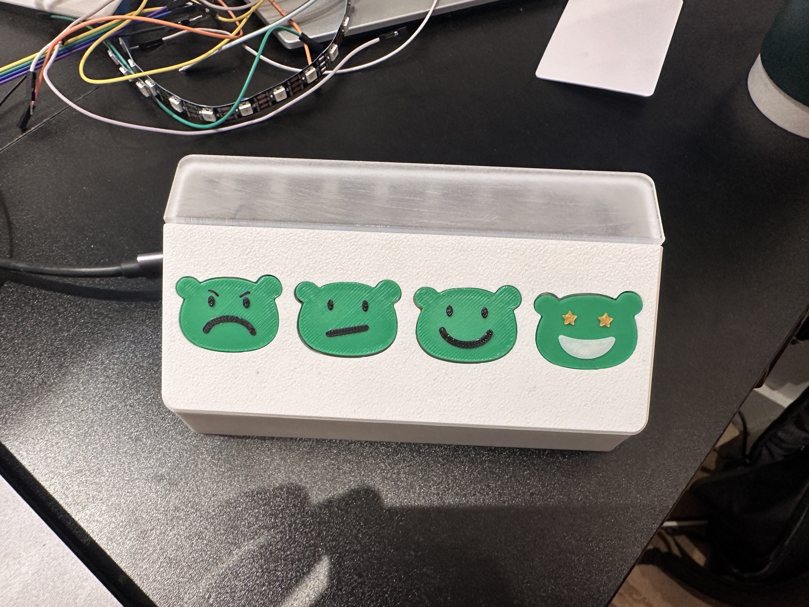
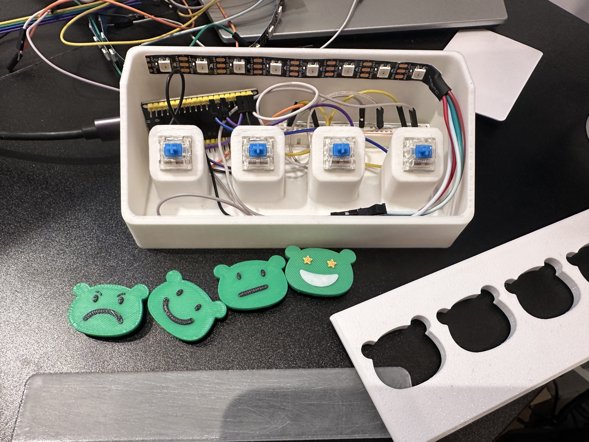

# feedback-kiosk

# Feedback Kiosk Hardware Prototype

**Project Description:**

Simple scrappy feedback kiosk. These kiosks are designed to collect user feedback in various settings such as retail stores, restaurants, events, and more.

**Features:**

- **Four Simple Buttons:** Easy-to-use interface with Cherry MX Blue switches.
- **LED Indicators:** Visual feedback using WS2812B LED.
- **Wi-Fi Connectivity:** Sends feedback data to Airtable in real-time.
- **Open-source:** Freely available for modification and distribution under the MIT License.
- **Spam Filter:** Prevents spam by limiting the number of buttons clicks per second.

## Installation

### Hardware Setup

1. **Components in the example:**
   - **Microcontroller:** ESP32
   - **LED:** WS2812B LED - cut to 8 LEDs
   - **Switches:** Cherry MX Blue switches
   - **Breadboard:** Small breadboard for prototyping
   - **Buttons and Casing:** 3D printed buttons and casing (STL files available in the `hardware/` directory)

2. **Assembly:**
   - Connect the ESP32 to the WS2812B LED and Cherry MX Blue switches on the breadboard.
   - Refer to the `hardware/connection_diagram.png` for detailed wiring instructions.
   - Use the 3D printed buttons and casing to house the components securely.

Yes I know my cable management is not pretty.

### Firmware Installation

1. **Install Required Libraries:**
   Open Arduino IDE and install the following libraries using the Library Manager (Tools > Manage Libraries):
   - FastLED
   - WiFi
   - HTTPClient
   - ArduinoJson

2. **Download Firmware:**
   - Download the firmware file `firmware.ino` from the `src/` directory.

3. **Configuration:**
   - Edit the configuration file in the `src/config/` directory to customize WiFi credentials and Airtable settings.

4. **Flashing Firmware:**
   - Use Arduino IDE to flash the firmware onto the ESP32 microcontroller.

## Usage

1. **Power Up:**
   - Connect the feedback kiosk to a power source.
   - The ESP32 will initialize and run the firmware.

2. **Interaction:**
   - Users can press any of the four buttons with Cherry MX Blue switches to provide feedback.
   - The WS2812B LED will indicate successful feedback submission through a breathing animation.

3. **Data Collection:**
   - Feedback data is collected and sent to Airtable (or any other API endpoint) in real-time.

## License

This project is licensed under the MIT License - see the `LICENSE` file for details.